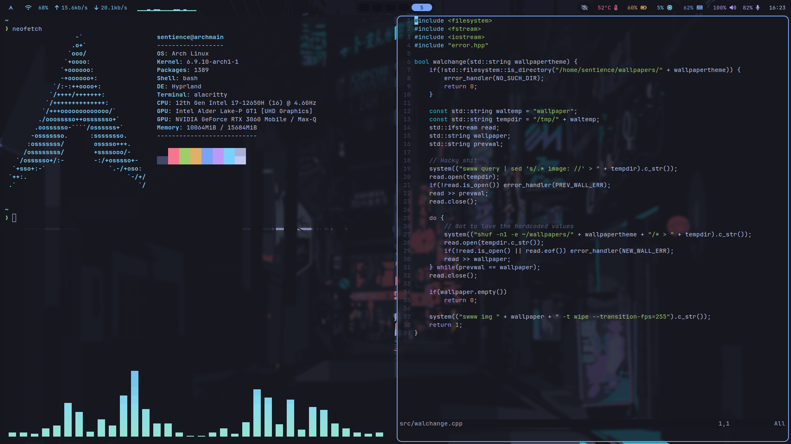

# My dotfiles - welcome to hell
## Setup
It's best to do that on a clean install. Because stow creates symlinks to the dotfiles directory where these files are needed. If someone somehow is reading this that is not me please do backup your configs.
Download stow
```
sudo pacman -S stow
```
```
git clone https://github.com/sentientbottleofwine/dotfiles.git
cd dotfiles/
stow .
```
That's it.
## Some screenshots


